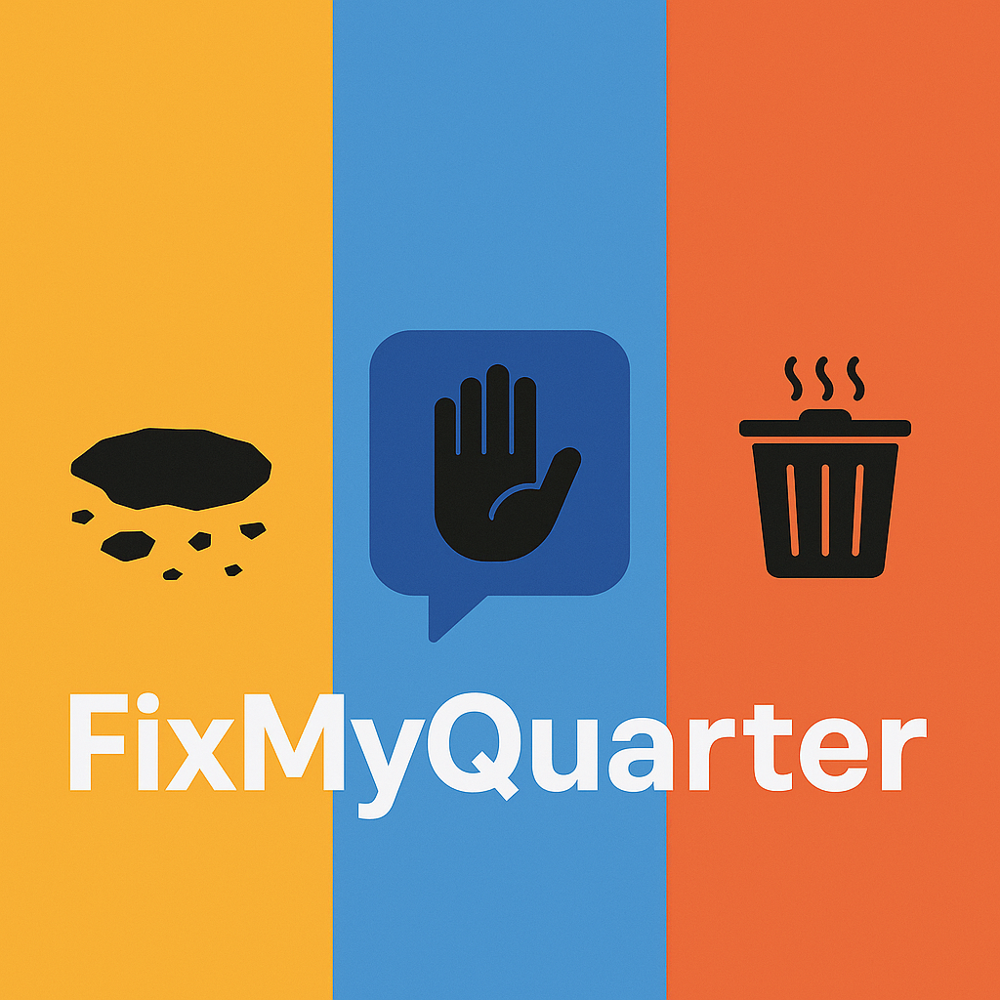

  

# **Projet : FixMyQuarter – Une plateforme communautaire pour la gestion participative des problèmes urbains**

---

## **1. Introduction générale**

Les villes modernes, petites ou grandes, partagent un défi commun : la gestion efficace des problèmes du quotidien rencontrés par leurs habitants. Comme ceux des nids de poules, ces incidents dégradent la qualité de vie et nuisent à la perception qu’ont les citoyens de leurs institutions.
Dans la plupart des cas, ces problèmes sont signalés par téléphone, e-mail, ou via les réseaux sociaux des canaux non centralisés, souvent inefficaces, qui entraînent une perte d’information, des doublons et des délais importants de traitement. Les municipalités, quant à elles, peinent à prioriser les actions et à mesurer leur impact faute d’outils structurés.

C’est pour répondre à cette problématique que naît **FixMyQuarter**, une **plateforme communautaire open-source** permettant aux citoyens de **signaler, suivre et résoudre les problèmes de leur quartier**, tout en favorisant la collaboration avec les associations et les autorités locales.
FixMyQuarter se veut **une solution numérique citoyenne**, moderne et inclusive, qui met la technologie au service du bien-être collectif.

L’objectif du projet est double :

1. **Simplifier la remontée et la gestion des incidents urbains**, grâce à une interface fluide et un traitement automatisé.
2. **Créer une intelligence collective locale**, où les habitants participent activement à l’amélioration de leur environnement.

Pour concrétiser cette vision, FixMyQuarter s’appuie sur une **architecture distribuée** et **hébergée dans le cloud**, garantissant performance, tolérance aux pannes, scalabilité et collaboration en temps réel.

---

## **2. Problématique et justification du projet**

### 2.1. Un manque de communication entre citoyens et institutions

Dans de nombreuses villes africaines, et plus largement dans les pays émergents, la participation citoyenne à la gestion urbaine est encore faible. Les habitants constatent les problèmes, mais manquent de canaux directs et accessibles pour les signaler. Les outils existants sont fragmentés : certains problèmes sont remontés par téléphone, d’autres via WhatsApp, d’autres encore via des formulaires papier.
Résultat : les signalements sont éparpillés, non centralisés, et rarement suivis d’actions concrètes.

### 2.2. Un déficit de priorisation et de traçabilité

Même lorsque les autorités locales reçoivent des signalements, il est difficile de savoir quels problèmes sont les plus urgents ou les plus récurrents.
De plus, les citoyens n’ont souvent aucune visibilité sur le traitement des incidents signalés : ils ne savent pas si une réparation est prévue, en cours, ou terminée. Ce manque de transparence alimente la méfiance et décourage la participation.

### 2.3. Une opportunité technologique et communautaire

Les outils numériques offrent aujourd’hui la possibilité d’impliquer activement les habitants dans la co-gestion de leur cadre de vie. Avec la généralisation des smartphones et de la 4G/5G, une application web et mobile peut devenir un **canal de communication centralisé** entre citoyens et autorités.
FixMyQuarter saisit cette opportunité en combinant **simplicité d’usage**, **collaboration communautaire**, et **infrastructure technologique moderne**, pour créer un service public numérique, participatif et durable.

---

## **3. Portée du problème et objectifs spécifiques**

FixMyQuarter se positionne comme une solution **locale mais extensible** à l’échelle d’un pays entier. Le projet vise à répondre aux défis suivants :

### 3.1. Objectif général

Créer une plateforme citoyenne participative pour **signaler, suivre et résoudre** les problèmes de quartier de manière transparente, collaborative et efficace.

### 3.2. Objectifs spécifiques

* Permettre aux citoyens de **signaler un incident** en moins de 30 secondes via une interface mobile-first.
* Offrir aux autorités et associations une **vision centralisée et cartographique** des problèmes remontés.
* Donner la possibilité à la communauté de **voter et commenter** pour prioriser les actions.
* Assurer une **communication bidirectionnelle** entre les institutions et les citoyens (statuts, photos, preuves de résolution).
* Garantir une **scalabilité technique**, une **tolérance aux pannes** et une **disponibilité continue** du service.
* Faciliter l’intégration avec des outils tiers (API publiques, webhooks, systèmes municipaux).

---

## **4. Solution proposée : une approche basée sur les systèmes distribués**

Les **systèmes distribués** sont au cœur de la conception de FixMyQuarter. Ils permettent de répartir les traitements sur plusieurs serveurs et de garantir que le service reste accessible, performant et cohérent, même en cas de forte charge ou de panne.

### 4.1. Scalabilité horizontale

FixMyQuarter adopte une architecture **stateless**, où les requêtes ne dépendent pas d’un serveur unique. Les instances du backend Flask peuvent être multipliées derrière un **load balancer**, ce qui permet d’ajuster dynamiquement les ressources selon la charge. Par exemple, en période de forte activité (campagne citoyenne, crise environnementale), de nouveaux nœuds peuvent être ajoutés instantanément.

### 4.2. Résilience et tolérance aux pannes

Les systèmes distribués offrent une **redondance naturelle** : si un composant échoue, un autre prend le relais.
FixMyQuarter met en œuvre des **retries automatiques**, un **backoff exponentiel** et des **dead-letter queues (DLQ)** pour éviter la perte de messages dans les files d’attente. Les opérations critiques sont idempotentes, ce qui garantit qu’un job relancé n’entraîne pas de duplication.

### 4.3. Communication asynchrone

Certaines tâches (redimensionnement d’images, envoi d’e-mails, notifications) sont exécutées via des **workers asynchrones** (Celery + Redis/RabbitMQ).
Cela libère le thread principal du serveur et améliore les temps de réponse pour l’utilisateur final.

### 4.4. Cohérence et synchronisation

Pour garantir la cohérence entre plusieurs services, le projet s’appuie sur une **base de données transactionnelle (PostgreSQL)** et des **caches distribués (Redis)**.
Les mises à jour sont atomiques, les verrous distribués empêchent les conflits d’accès, et les utilisateurs voient toujours l’état le plus récent des signalements.

### 4.5. Géodistribution et performance

Les services peuvent être déployés dans plusieurs régions géographiques (par exemple en Afrique centrale et en Europe), afin de réduire la latence et d’offrir une meilleure expérience à tous les utilisateurs.

---

## **5. Apport du cloud computing dans la solution**

Les **services cloud** sont essentiels pour concrétiser cette vision distribuée sans lourdes contraintes d’infrastructure.
FixMyQuarter utilise le cloud pour **déployer, stocker, monitorer et faire évoluer** la plateforme de manière souple et économique.

### 5.1. Élasticité et optimisation des coûts

Grâce aux capacités d’**autoscaling** du cloud comme c'est le cas de AWS ECS, les ressources s’adaptent automatiquement à la demande.
Le modèle **pay-as-you-go** permet de payer uniquement pour les ressources réellement consommées.

### 5.2. Stockage et distribution de contenu

Les images et documents sont stockés sur des **services de stockage objet** (Amazon S3 ), ce qui garantit la sécurité, la durabilité et la distribution mondiale via CDN.

### 5.3. Sécurité et conformité

Les fournisseurs cloud offrent des mécanismes de chiffrement, d’authentification et de journalisation conformes aux bonnes pratiques (TLS, OAuth2, RBAC).
L’architecture inclut également des contrôles de validation côté serveur pour éviter les abus (rate limiting, filtrage d’images, audit logs).

### 5.4. Observabilité et supervision

Le projet inclut des **dashboards Grafana** et des **métriques Prometheus** pour suivre en temps réel la performance et la disponibilité.
Des sondes de santé (readiness/liveness) et des alertes permettent une maintenance proactive.

---

## **6. Conception et architecture du système**

### 6.1. Vue d’ensemble

L’architecture de FixMyQuarter est composée de plusieurs couches coopérantes :

* **Frontend (Next.js)** : interface utilisateur moderne, réactive et mobile-first.
* **Backend (Flask)** : API REST stateless exposant les endpoints pour la création et le suivi des signalements.
* **Base de données (PostgreSQL)** : stockage relationnel fiable et extensible.
* **File d’attente (Redis)** : gestion asynchrone des tâches lourdes.
* **Stockage de médias (S3)** : hébergement des images et fichiers.
* **Monitoring (Prometheus, Grafana)** : métriques, logs et supervision.

### 6.2. Communication interservices

Les services communiquent via HTTP et messages asynchrones.
L’API REST centralise la logique métier, tandis que Celery exécute les tâches non bloquantes (webhooks, mails, traitement d’images).

### 6.3. Sécurité et gestion des accès

Le modèle RBAC (Role-Based Access Control) gère les rôles :

* **Citoyen** : crée et suit des signalements.
* **Modérateur** : valide et commente.
* **Opérateur** : résout les incidents.
* **Administrateur** : gère les utilisateurs et supervise les données.

L’authentification repose sur **JWT/OAuth2** et toutes les communications passent par HTTPS.

---

## **7. Choix technologiques et justification**

| Composant             | Technologie                     | Justification                                                        |
| --------------------- | ------------------------------- | -------------------------------------------------------------------- |
| **Backend**           | Python + Flask                  | Léger, rapide, parfait pour des APIs REST stateless                  |
| **Base de données**   | PostgreSQL                      | Robuste, open-source, supporte les transactions complexes            |
| **Asynchrone**        | Celery + Redis/RabbitMQ         | Exécution en arrière-plan, fiabilité, retry et backoff               |
| **Cache**             | Redis                           | Réduction de la latence, stockage temporaire des requêtes fréquentes |
| **Stockage fichiers** | Amazon S3                       | Haute disponibilité et intégration cloud                             |
| **Frontend**          | Next.js + React                 | Rapidité, UX moderne, responsive, SEO-friendly                       |
| **Monitoring**        | Prometheus + Grafana            | Observabilité distribuée, alertes en temps réel                      |
| **Conteneurisation**  | Docker + docker-compose         | Reproductibilité et déploiement simplifié                            |
| **CI/CD**             | GitHub Actions                  | Intégration continue automatisée                                     |
| **Déploiement**       | AWS                             | Simplicité, élasticité et coût maîtrisé                              |

---

## **8. Conception UX/UI**

Le frontend est pensé pour être **simple, rapide et inclusif**.

* Un citoyen peut créer un signalement en **moins d'une minute**.
* L’interface présente une **carte interactive (Leaflet)** et une **liste filtrable**.
* Les statuts “Open”, “In progress”, “Resolved” sont visibles par tous.
* Les formulaires utilisent **React Hook Form + Zod** pour la validation.
* Le design suit le principe *mobile-first* afin d’être utilisable sur tous les appareils.

---

## **9. Planification et calendrier d’activités**

| Phase       | Activités principales                                                     | Durée estimée | 
| ----------- | ------------------------------------------------------------------------- | ------------- | 
| **Phase 1** | Analyse du problème, définition des besoins, étude des systèmes existants | 1 semaines    | 
| **Phase 2** | Conception de l’architecture distribuée et du modèle de données           | 2 semaines    | 
| **Phase 3** | Développement du backend Flask (API, authentification, base de données)   | 2 semaines    | 
| **Phase 4** | Développement du frontend Next.js et intégration carte + formulaires      | 2 semaines    |
| **Phase 5** | Mise en place de Celery, Redis, RabbitMQ et tâches asynchrones            | 1 semaines    | 
| **Phase 6** | Intégration du stockage objet (S3) et CDN                                 | 1 semaine     | 
| **Phase 7** | Déploiement sur le cloud (Render, Railway, AWS) + CI/CD GitHub Actions    | 1 semaines    | 
| **Phase 8** | Tests, monitoring, sécurité, documentation et communication               | 1 semaines    | 
| **Phase 9** | Lancement pilote et collecte des retours utilisateurs                     | 1 semaines    | 

Durée totale estimée : **3 à 4 mois**, avec des itérations agiles et des points de contrôle hebdomadaires.

---

## **10. Conclusion**

FixMyQuarter est bien plus qu’une simple application de signalement. C’est un **système distribué intelligent**, soutenu par le **cloud computing**, qui transforme la participation citoyenne en véritable levier d’action collective.
Grâce à son architecture modulaire, son approche open-source et sa scalabilité, le projet peut être déployé dans n’importe quelle ville du monde, tout en restant léger, résilient et économique.

Ce projet illustre comment la technologie, lorsqu’elle est bien pensée et distribuée, peut renforcer la démocratie locale, restaurer la confiance entre citoyens et institutions, et rendre les villes plus vivables, plus propres et plus humaines.
